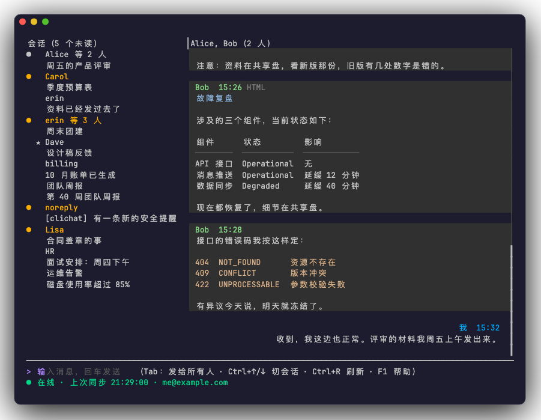
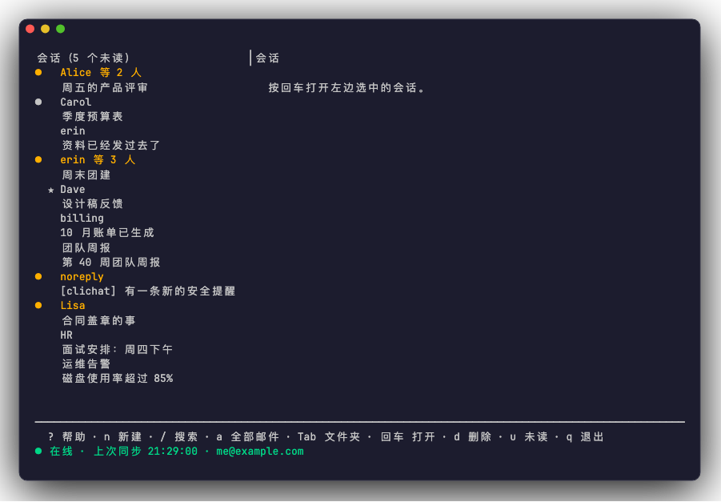
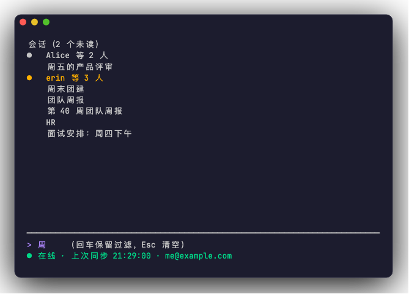
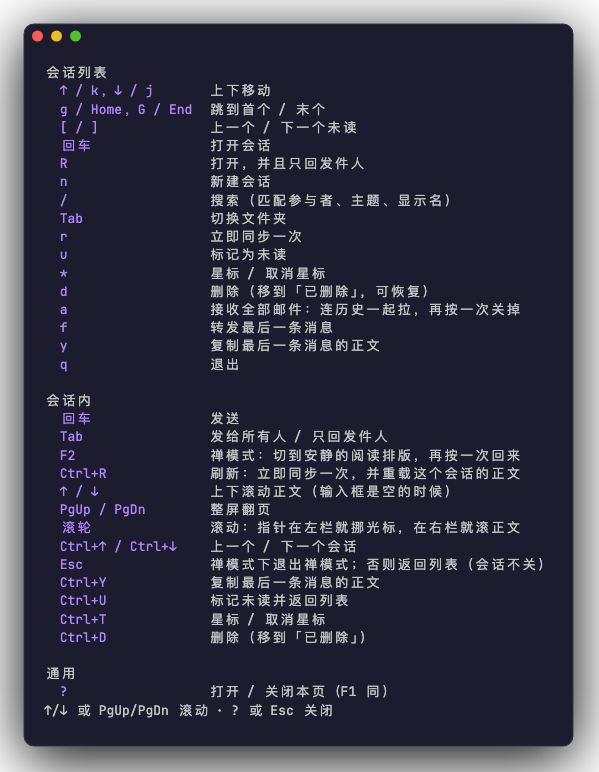
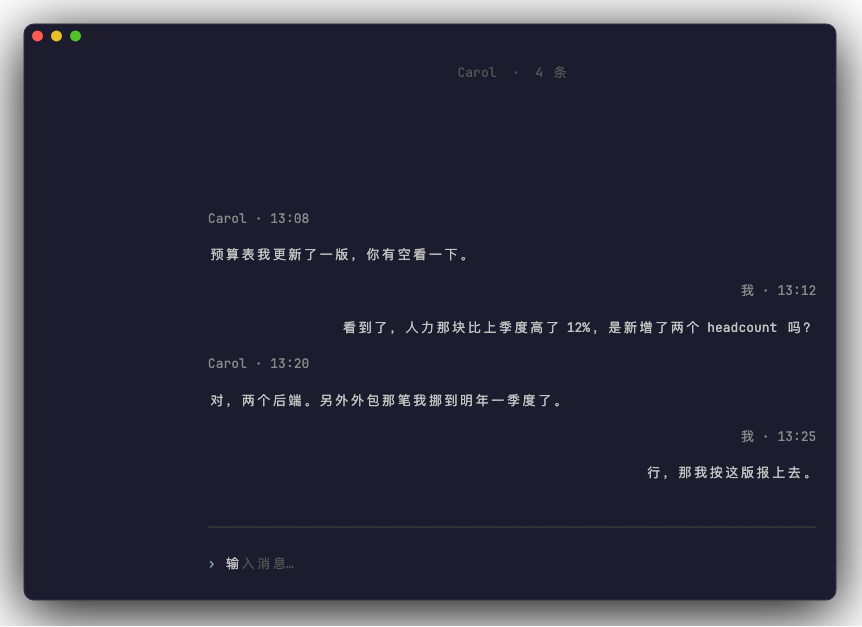
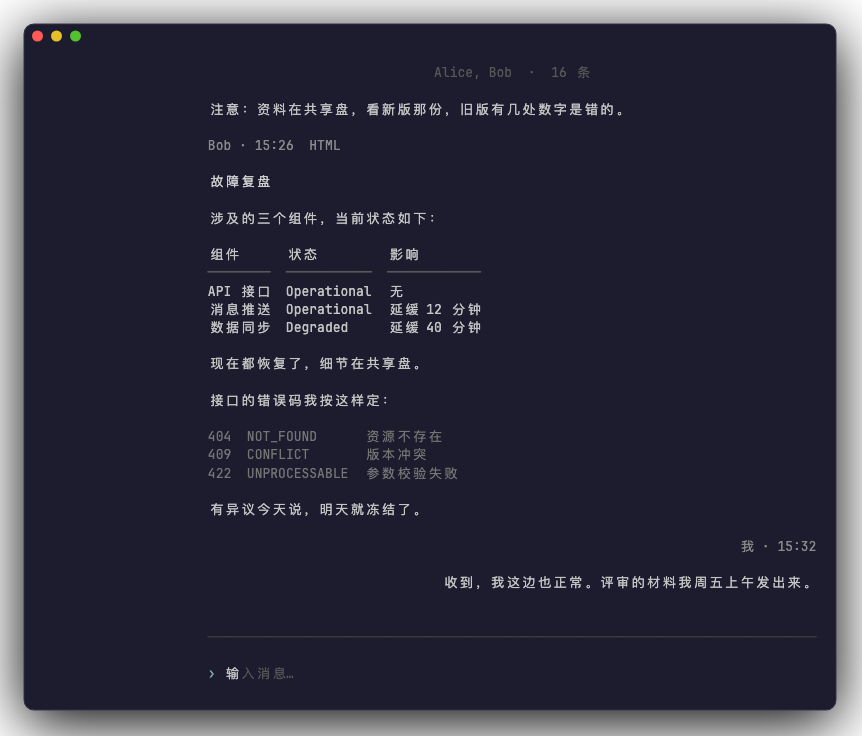
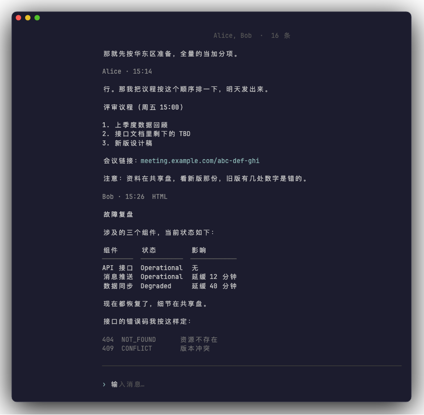
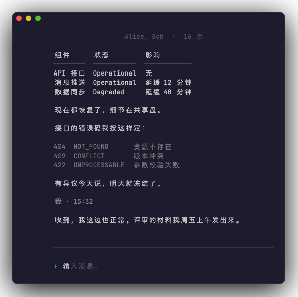

# clichat

### Chat in your terminal — using the email account you already have

**English** | [中文](README_ZH.md)

[](https://github.com/PleaseEnterYourText-Studio/clichat/releases)
[](https://github.com/PleaseEnterYourText-Studio/clichat/releases)
[](https://github.com/PleaseEnterYourText-Studio/clichat/releases)
[](go.mod)

[Download](#download) · [Quick Start](#quick-start) · [Features](#features) · [Shortcuts](#keyboard-shortcuts) · [FAQ](#faq)

---

## Why clichat?

Email is the most universal open messaging system there is. Everyone already has
an address. Nobody has to install anything to talk to you.

But email clients insist on treating it as **correspondence** — subject line,
salutation, signature, quoted history, "Dear Sir/Madam". A conversation that
took four messages over two hours ends up looking like a small pile of paperwork.

clichat just looks at it differently: **treat mail as messages.**

- **Conversations, not messages.** A conversation is the set of people on the
  other side, so it is what the conversation actually *is* — Alice writing to you
  and you writing to Alice are one conversation, and a message to
  `[Alice, Bob]` is another. No subject-line guessing: merging two unrelated
  discussions that happen to share a title is worse than leaving them apart.
- **One binary, no server.** IMAP and SMTP go straight from your machine to your
  provider. There is no clichat account, no relay, no third party in the middle.
- **Your credentials stay yours.** The auth code is encrypted with a master
  password you choose, and stored locally. It is never sent anywhere except your
  own mail server.
- **No custom mail format.** v1 does not invent anything on the wire — so
  everything you send stays readable in any other client, and mail sent from
  elsewhere threads correctly in clichat.

## Screenshots

**Conversation view** — the other side's rows sit on a grey band while yours are
right-aligned; in group threads every sender is coloured. The `HTML` marker in a
message head means that body was converted from an HTML mail:

[](docs/images/01-chat.png)

**Conversation list** — unread count in the header, `●` for unread, `★` for
starred:

[](docs/images/02-list.png)

**Search** — live filtering across participants, subject and display name:

[](docs/images/03-search.png)

**Help** — press `?` for the full keymap:

[](docs/images/04-help.png)

**Zen mode** — press `F2` for a quiet, typography-first reading layout: no
sidebar, no status bar, no message bubbles. The body sits in a centred column
that never stretches past 78 columns, and consecutive messages from the same
person are grouped under a single name and timestamp:

[](docs/images/05-zen-chat.png)

**Zen mode, group thread** — grouping when several people take turns:

[](docs/images/06-zen-group.png)

**Zen mode, long body** — Markdown headings, lists, links, code blocks and
tables all render inside that narrow column:

[](docs/images/07-zen-long.png)

**Zen mode, narrow terminal** — below 80 columns your own messages stop being
right-aligned and everything falls back to a single column:

[](docs/images/08-zen-narrow.png)

## Download

Grab a prebuilt binary from the [Releases](https://github.com/PleaseEnterYourText-Studio/clichat/releases)
page. Every commit to `main` publishes a new beta build.

| Platform | File |
|---|---|
| Windows (x64) | `clichat-windows-amd64.exe` |
| Windows (ARM64) | `clichat-windows-arm64.exe` |
| macOS (Apple silicon) | `clichat-darwin-arm64` |
| macOS (Intel) | `clichat-darwin-amd64` |
| Linux (x64) | `clichat-linux-amd64` |
| Linux (ARM64) | `clichat-linux-arm64` |

**macOS** — the binaries are not code-signed, so Gatekeeper will block them on
first run. Clear the quarantine flag:

```bash
chmod +x ./clichat-darwin-arm64
xattr -d com.apple.quarantine ./clichat-darwin-arm64
./clichat-darwin-arm64
```

**Linux** — make it executable first:

```bash
chmod +x ./clichat-linux-amd64
./clichat-linux-amd64
```

**Windows** — SmartScreen may warn about an unsigned binary; click *More info* →
*Run anyway*.

Each release ships a `SHA256SUMS.txt`. Verify with:

```bash
sha256sum -c SHA256SUMS.txt
```

## Quick Start

```bash
clichat
```

On first run a four-step wizard asks for:

1. **Provider** — QQ Mail, 163, 126, Gmail, or custom (fill in the servers yourself)
2. **Email address**
3. **Auth code** — *not* your login password. Nearly every provider requires an
   app-specific password or authorization code for IMAP/SMTP. The wizard shows
   you where to get one for the provider you picked.
4. **Master password** — at least 4 characters. It encrypts the auth code before
   it touches the disk, and is never transmitted anywhere.

You will be asked for the master password every time you start. Forgetting it
means re-configuring the account — press `Ctrl+R` on the unlock screen to do that.

### Command-line flags

| Flag | What it does |
|---|---|
| `-check` | Read-only connection self-test: connect once, report which step fails. Reads your saved config, so it does not ask for anything except the master password. |
| `-check-deep` | Same, plus a real measurement of the initial sync. Slower. Implies `-check`. |
| `-version` | Print the version and exit. This is also the version reported to the server via IMAP `ID`. |
| `-config-dir` | Print the config directory and exit. |

In scripts, pass the master password via the `CLICHAT_MASTER` environment
variable — `-check` reads it before falling back to an interactive prompt. There
is deliberately no password flag: command-line arguments leak into shell history
and the process list.

## Features

**Reading**

- **A conversation is a set of participants.** The key is the set of addresses
  on the other side, excluding you: mail Alice sent you and mail you sent Alice
  land in the same conversation, while a message addressed to just
  `[Alice, Bob]` is a separate one. That is what a chat means by a conversation —
  it is *who*, not *which reply chain*. (Earlier versions chained
  `References` / `In-Reply-To`; the moment someone else replied it fell apart
  into a new thread, and long mail lists shattered.)
- The list **titles a conversation with the other side's name** (participants,
  for a group) and puts what you are actually talking about on the second line —
  that is the subject of the newest message. A conversation spans many subjects,
  so those are two different questions
- **The other side's rows sit on a grey band**, while yours are right-aligned
  with no background — after a few exchanges you no longer have to read names to
  tell who is talking. The grey adapts to the terminal's lightness
- Group conversations detected automatically; each sender gets a stable colour,
  so the same person is the same colour in every session
- HTML mail converted to Markdown: links and buttons come through as clickable
  addresses, tables, lists and code blocks keep as much of their shape as
  they can, and headings are recovered from **font size** while bold is read
  from `font-weight` (real mail styles them, it does not tag them); quoted
  history trimmed — this is a chat view, and quoting is noise in it. See [HTML
  mail, turned into Markdown](#html-mail-turned-into-markdown) for how
- …and that Markdown is rendered back into terminal styling — headings lose
  their hashes and are colour-coded by level, list items get real numbers,
  tables come out as aligned columns, images show their `alt` text, links stay
  clickable, and horizontal rules span the whole chat pane. You read mail, not
  markup
- **Messages that came from HTML carry an `HTML` marker in the message head.**
  The conversion is lossy (buttons, tables and font-size headings all get
  re-flowed); the marker is there so "the layout differs from the original mail"
  has an explanation instead of looking like a rendering bug
- Two-pane layout, collapsing to a single pane under 80 columns

**Acting**

- Compose, reply, reply-all (`Tab` toggles) and forward
- Star (`*`), mark unread (`u`), delete (`d`)
- Delete moves the mail to the server's *Deleted* folder — it is recoverable,
  and it asks for confirmation first
- Copy the last message body to the system clipboard (`y`)
- Search across participants, subject and display name, filtering as you type
- Switch folders (`Tab` in the list) — the folder list comes from the server
  via IMAP `LIST`, so it works whatever your provider calls things

**Keeping it working**

- Cold start pulls only the last 90 days / 500 messages, whichever comes first
- **Refresh**: when polling finds new mail, the open conversation's bodies
  reload with it, so sitting in a chat never leaves you on last round's screen;
  inside a conversation `Ctrl+R` syncs immediately and re-reads its bodies.
  A poll that found nothing does *not* reload them — otherwise every 30-second
  tick would turn into a full network round-trip
- "All mail" mode (`a` in the list) rewinds the local cursor and pulls the whole
  history in one go. While it is on, the status bar keeps saying so — the first
  sync gets noticeably slower, and that should not be a surprise
- Incremental sync by UID; reconnects resume from the last UID
- `UIDVALIDITY` changes are detected and the local index is rebuilt
- A single unparseable message is skipped and logged, not fatal
- Runs on any provider whose IMAP advertises the `ID` extension (see FAQ)

**Under the hood**

- Pure Go, `CGO_ENABLED=0`, one static binary per platform
- Credentials: Argon2id + NaCl secretbox
- Local index is plain JSON — no database
- Everything on disk lives in one directory you can delete

## HTML mail, turned into Markdown

The mail you actually care about is HTML — and that HTML is not a document, it
is a **layout**. A "Confirm subscription" button is an `<a>` wrapped in inline
CSS: strip the tags and the words survive but the address does not, and the
address was the only part that mattered. A marketing mail's *entire body* is
often one padded `<table>`. Neither survives a regex.

So clichat parses the HTML into a DOM (`golang.org/x/net/html`) and walks it,
emitting Markdown. The rules it follows:

- **Links and buttons both become `[text](url)`.** A button in mail is either a
  styled `<a>`, or a `<button>` / `<input type=submit>`. Only the first carries
  an `href`, so both go through one fallback chain: `href`, `formaction`,
  `data-href`, `data-url`, `data-link`, and finally any URL inside `onclick`.
  Find one and it becomes a link. Find none and the label is bolded instead — a
  button with no target cannot be a link, but it should not read as body text
  either.
- **Image buttons use their `alt`.** `<a></a>` is how a
  lot of transactional mail ships its buttons. A terminal cannot show the
  image, and `alt` is exactly the text the sender wrote for when it cannot.
- **A bare `` becomes ``.** Same reasoning, minus the link: the
  `alt` is all a terminal can show. With no `alt` and no `title` to fall back
  on, it becomes a placeholder word rather than an empty label — an empty label
  still leaves the `src` on screen, and that `src` is usually a tracking URL
  carrying an identifier of yours.
- **Emphasis is wrapped around the content, not the element.** `**hello **`
  does not render as bold — the trailing space pushes the marker off — so
  `<b>hello </b>world` has to come out as `**hello** world`, with the space
  moved outside the markers.
- **A `<table>` is read as either data or layout.** Header cells in the first
  row, or an equal column count across rows, means data: a Markdown table.
  Otherwise it is layout, and the cells are rendered as stacked blocks.
  Flattening a layout table would collapse the entire mail into one line.
- **Headings are recovered from font size, not just from `<h1>`-`<h6>`.** Real
  mail barely uses heading tags — clients strip their built-in styling, so
  senders write the size straight into the markup instead:
  `<td style="font-size:28px;font-weight:bold">`. Trust only the tags and the
  hierarchy of the whole mail collapses in conversion: title, section headings
  and body all come out as the same-sized paragraphs. So we first estimate the
  message's **body size** (weighted by how much text each size carries, counting
  only the innermost declaration, with ties going to the smaller one), then map
  markedly larger sizes onto `#`-`######` in bands. The test is deliberately
  strict: the element must declare its own `font-size` (inherited does not
  count), and its content must hold no block element, link, button or image —
  buttons are the most title-like thing there is (big, bold, white on colour),
  and only "it is an `<a>` inside" tells them apart.
- **Bold is read from styles too, not just from `<b>`.** Same cause: templates
  put `font-weight:bold` in `style`, and trusting only the tags flattens every
  emphasis in the body. `bold`, `bolder` and `600`-`900` all count, as does the
  old `<font weight="bold">`.
- **Markers must never nest into a string the renderer cannot read.** A style
  bold and a tag bold on top of each other would emit `**a**b****`, and
  `<b><i>a</i></b>` would emit `***a***` — the renderer deliberately rejects
  ambiguous runs of asterisks (it shows the line verbatim rather than guess), so
  the generator has to flatten instead: once inside asterisks, no inner marker.
  `~~` is exempt — it does not collide with asterisks, and `**a~~old~~**`
  renders fine.
- **Body text is escaped.** A message containing `2*3` or `[TODAY]` should not
  come out italic, or open a link nobody wrote.
- **Quoted history is dropped.** In a chat view, re-quoting the thread you just
  read is noise — the thread already has it.

It does not try to reproduce CSS. A terminal has no `margin-left: 40px`.

### And then it renders it

Emitting Markdown is only half the job. A terminal that prints `**note**` as
`**note**` has just moved the problem somewhere else — and until recently that
is exactly what happened here. The conversation view now renders the body back
into something readable: `###` becomes a bold line, list items get their real
numbers (`1.` `2.` `3.`, not three `1.`s — the generator writes `1.` for every
item on purpose), `[text](url)` shows only the text and stays clickable, and
`2*3`, escaped on the way in, comes back as `2*3`.

**Headings also have to stay distinguishable.** A terminal has no font size, so
the only dimensions left are **colour** and **bold**. Six levels would mean some
of them look identical, which is a lie — so they fold into three tiers by
structural role:

| Level | On screen | Why |
| --- | --- | --- |
| `#` `##` | accent colour + bold | what the message is about |
| `###` `####` | another colour + bold | what this section is about |
| `#####` `######` | bold only | barely occurs in mail; no second colour |

Only the parser knows which levels count as "large"; the renderer just turns
that into style — the banding is Markdown's semantics, not the terminal's. The
prominence lives in the top two bits of `attrs`, making it the one
**multi-valued** attribute there (the rest are on/off; a heading level is
genuinely a value).

There is no Markdown library in the loop. The input is a **closed** set of
syntax, because clichat is what wrote it in the first place: every `*`,
backtick, `_`, `[`, `]` and `<` that came from the mail was escaped into
`\<char>` on the way out. So an unescaped `*` is always one of ours, and the
parser can be exact where a general-purpose one has to guess.

**Closed means closed, and that is the part that broke.** Two things the
generator had been emitting for a long time were never taught to the renderer:
`` and Markdown tables. Neither failed loudly. They came out as
markup — `` rendered as `!perational` (the `!` survives, the
image does not), a status table rendered as three lines of `| 组件 | 状态 |`,
and `` put a whole tracking URL in the middle of the conversation.

The lesson is in the test suite now. The renderer's test file ends with a
**cross-package invariant**: real HTML goes through the *real* generator and
then the *real* renderer, and the result is checked for both halves — no markup
may reach the screen, and the text must still be there. Testing each side on
its own is exactly how this got through; both suites were green while the
seam between them was empty. Whenever the generator learns a new syntax, that
test should be the thing that tells you the renderer has not.

Two details that decide whether it looks right:

- **Wrapping happens on plain text, before any colour is applied.** A colour
  escape sequence is a pile of characters, and anything that measures width per
  rune counts them as columns — so wrapping after colouring breaks lines in the
  wrong place, and cuts sequences in half. Colour goes on last.
- **Links get colour and nothing else.** Give a link's style an underline and
  the renderer emits a separate sequence per character, which shreds the
  clickable-link sequence: the link still *looks* right and simply stops
  working. Clichat would rather have a clickable link than a decorated one.

Tables get one extra rule: **they do not wrap.** Break a table row across lines
and the columns stop lining up, at which point the table is worse than the
plain text it replaced. So an over-wide table is truncated column by column —
narrow columns like a status word are never squeezed for the sake of a wide
one — and only at absurdly narrow widths does it give up on alignment entirely
and lay the cells out as ordinary wrapped text.

## Keyboard Shortcuts

Press `?` anywhere for the built-in help page. The list footer always shows the
most common keys.

**Conversation list**

| Key | Action |
|---|---|
| `↑` / `k`, `↓` / `j` | Move |
| `g` / `Home`, `G` / `End` | First / last |
| `[` / `]` | Previous / next unread (wraps around) |
| `Enter` | Open conversation |
| `R` | Open, replying to sender only |
| `n` | New conversation |
| `/` | Search |
| `Tab` | Switch folder |
| `r` | Sync now |
| `u` | Mark unread |
| `*` | Star / unstar |
| `d` | Delete (moves to *Deleted*) |
| `f` | Forward last message |
| `y` | Copy last message body |
| `a` | All mail: pull the whole history too, press again to turn off |
| `?` | Help |
| `q` / `Ctrl+C` | Quit |

**Inside a conversation**

The text input has focus here, so single letters would be typed into your
message — every action uses a `Ctrl` combination instead.

| Key | Action |
|---|---|
| `Enter` | Send |
| `Tab` | Reply-all / reply-to-sender |
| `F2` | Zen mode: a quiet reading layout. Press again to go back |
| `Ctrl+R` | Refresh: sync once now, and re-read this conversation's bodies |
| `↑` / `↓` | Scroll the conversation (when the input box is empty) |
| `PgUp` / `PgDn` | Scroll a screen |
| Wheel | Scrolls whatever the pointer is over: the list cursor on the left, the conversation on the right |
| `Ctrl+↑` / `Ctrl+↓` | Previous / next conversation |
| `Esc` | Leave Zen mode; otherwise back to list. The conversation stays open — `Enter` returns to it |
| `Ctrl+Y` | Copy last message body |
| `Ctrl+U` | Mark unread and go back |
| `Ctrl+T` | Star / unstar |
| `Ctrl+D` | Delete |
| `F1` | Help |
| `Ctrl+C` | Quit |

A scroll bar appears on the right edge of the conversation once it is longer
than one screen — which is also the answer to "is this thing scrollable at
all?".

## FAQ

**Which providers work out of the box?**

QQ Mail, 163, 126 and Gmail ship as presets — they fill in the servers and ports
and tell you where to get the auth code. Anything else works via *Custom*.

**Why is personal Outlook / Outlook.com not in the list?**

Microsoft disabled IMAP/SMTP basic authentication for personal accounts on
2024-09-16. A password will not connect; it requires OAuth2, which v1 does not
implement. This is a deliberate omission, not an oversight. iCloud is left out
too — its server addresses were never verified, and a wrong preset is worse than
no preset.

**163 / 126 fails with `Unsafe Login. Please contact kefu@188.com`**

NetEase requires clients to announce themselves with an IMAP `ID` command
(RFC 2971) after login, or it rejects the next command. Note the failure is
misleading: `LOGIN` succeeds and the error appears on the following `EXAMINE`.
clichat sends the `ID` command since v0.1.0-beta.9. If you are on an older build,
upgrade.

**Can't connect — how do I find out which step fails?**

```bash
clichat -check
```

It connects once using your saved config and reports step by step: (1) log in and
select INBOX, (2) fetch a batch of headers, (3) probe the Sent folder. **Whichever
step it stops at tells you which layer is broken** — a bad auth code, provider
rate limiting, or an unreachable port.

The check is **read-only**: it never reads a body, never prints subjects or
senders, and never marks anything as read. Its output is safe to paste into an
issue.

Add `-check-deep` to also measure how long the initial sync takes. A few hundred
headers can take tens of seconds, and the UI only says "syncing…" during that
time — easy to mistake for a hang. This number tells you whether it is genuinely
slow or actually stuck.

**Do I have to type the master password every time?**

Yes, in v1. Storing it in the OS keychain is on the roadmap.

**Where is my data stored?**

| Platform | Directory |
|---|---|
| Windows | `%AppData%\clichat` |
| macOS | `~/Library/Application Support/clichat` |
| Linux | `~/.config/clichat` |

| File | Contents | Encrypted |
|---|---|---|
| `config.json` | account, servers, sync policy | no |
| `credentials.enc` | auth code | **yes**, master password |
| `index.json` | message header index | no |
| `clichat.log` | runtime log — events only, no message bodies | no |

Deleting the whole directory resets everything.

**Search does not find an old message.**

Search covers only what is synced locally — by default the last 90 days or 500
messages. It does not query the server. Widen `sync.initial_days` /
`sync.initial_max_messages` in `config.json` if you need more, or press `a` in
the conversation list to turn on "All mail" and pull the whole history down.
Once it is down, those messages are searchable too.

**Does `d` really delete the mail?**

No. It moves the mail to the server's *Deleted* folder, and you can recover it
from webmail. If the server supports the IMAP `MOVE` extension clichat uses it;
otherwise it falls back to `COPY` + `\Deleted` + `EXPUNGE`.

**Are attachments supported?**

Not in v1. Attachments are ignored when parsing, and the body shown is the text
part.

**Multiple accounts?**

Not in v1.

**Something is broken — how do I get details?**

The log is at `clichat.log` in the directory above. For connection-layer
problems, set `CLICHAT_IMAP_DEBUG=1` before starting and the full IMAP
conversation is written to the same file — **including message headers and
bodies**, so turn it off when you are done.

## Development

Requires Go 1.26.2 or newer.

```bash
git clone git@github.com:PleaseEnterYourText-Studio/clichat.git
cd clichat

go vet ./...
go test -race ./...
go build -o clichat .
```

The layout, top-down by dependency:

| Package | Responsibility |
|---|---|
| `internal/thread` | Pure functions: group by participant set, order, count unread and stars. No IO, fully unit-tested |
| `internal/mail` | IMAP fetch / SMTP send / MIME parsing, behind a `Client` interface |
| `internal/store` | Header index, persisted as JSON |
| `internal/config` | Config, provider presets, Argon2id + secretbox credential encryption |
| `internal/logging` | Runtime log |
| `internal/app` | Orchestration — wires the four above together |
| `internal/tui` | Bubble Tea interface |

Automated tests never touch a real mailbox; `mail.Fake` provides an in-memory
implementation. `internal/tui/screenshot_test.go` regenerates the images used in
this README — see the comment at the top of that file.

## Contributing

Issues and pull requests are welcome. Before opening a PR:

- `go vet ./...` and `go test -race ./...` should pass
- Keep the existing comment style: explain *why*, especially for anything that
  looks like it could be simplified but cannot be

Note: pushing to `main` publishes a release automatically, so work in a branch.

## License

Not specified yet — until then, all rights reserved. If you intend others to use
this, adding a `LICENSE` file is the way to change that.
